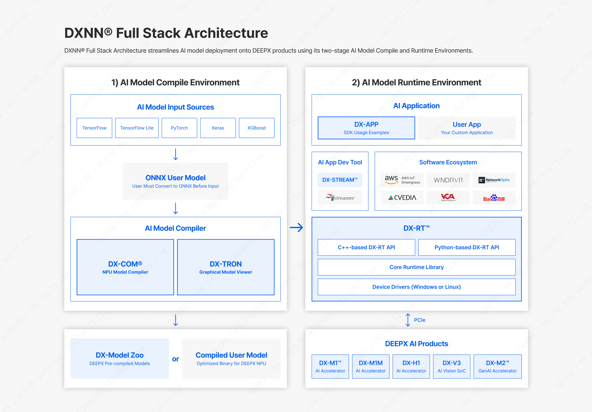

# DXNN® - DEEPX NPU SDK (DX-AS: DEEPX All Suite)

DX-AS (DEEPX All Suite) is an integrated environment of frameworks and tools that enables inference and compilation of AI models using DEEPX devices. Users can build the integrated environment by installing individual tools, but DX-AS maintains optimal compatibility by aligning the versions of the individual tools.

## Documentation

For detailed guides on running demo applications and templates, refer to the following documents:

### Introduction
[Link](docs/source/index.md)

### Installation Guide
[Link](docs/source/installation.md)

### Getting Started
[Link](docs/source/getting-start.md)

### Version Compatibility
[Link](docs/source/version_compatibility.md)

### FAQ
[Link](docs/source/faq.md)

### Make Docuemtment
[Link](docs/make_docs.md)

